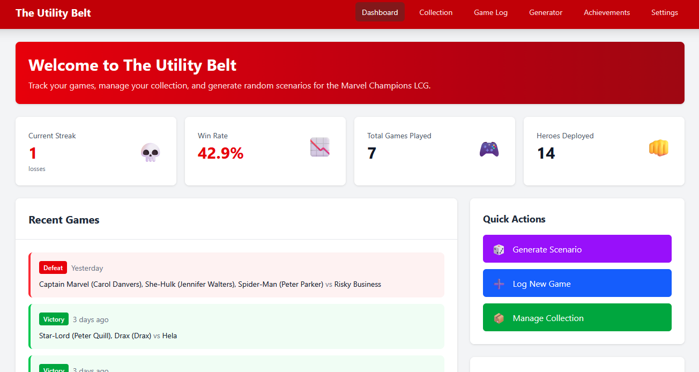
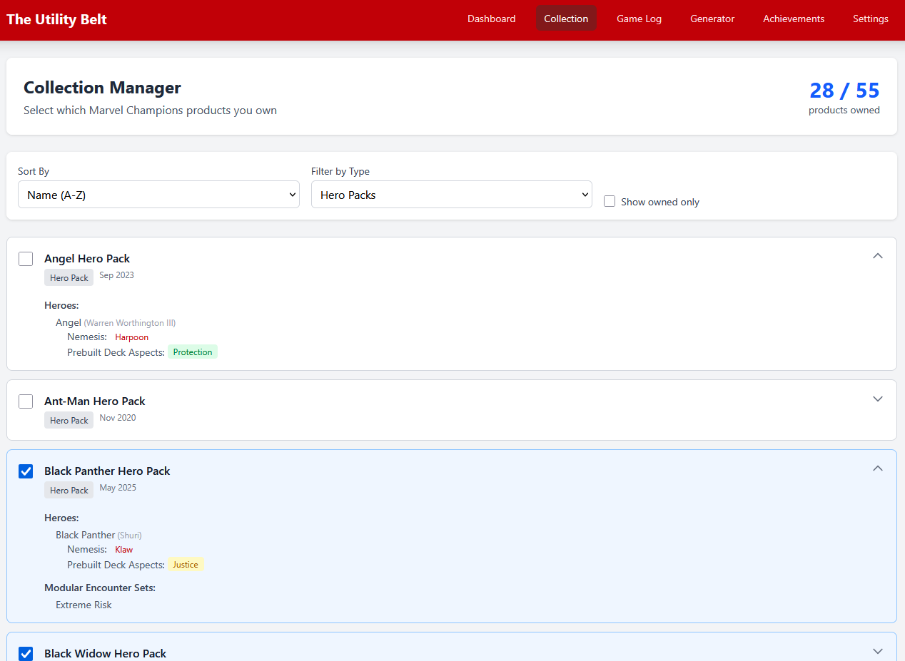
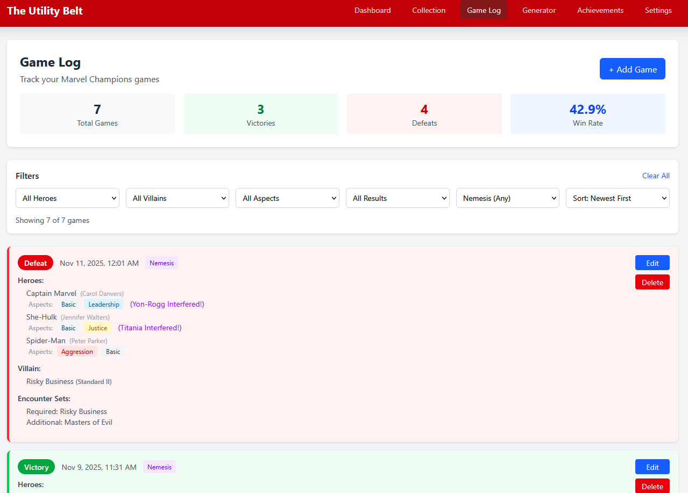
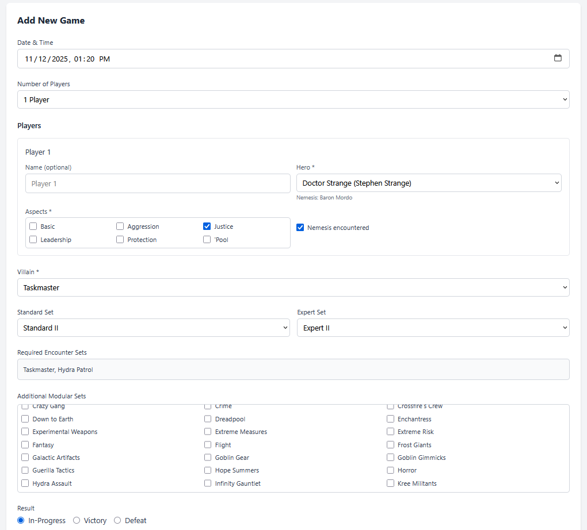
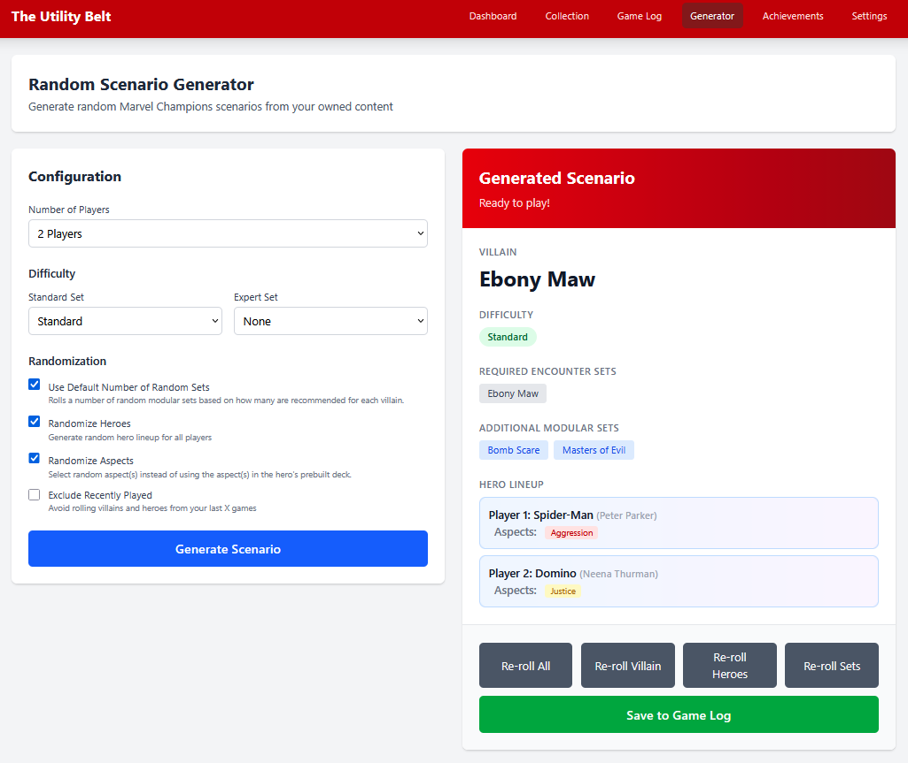

# The Utility Belt

**The Utility Belt** is an unofficial companion app designed by [Ethan Eastwood](mailto:contact@ethaneastwood.dev) for the **Marvel Champions** LCG by Fantasy Flight Games. 
Track and log games, manage your product collection, and generate random scenarios for Marvel Champions!

Find it [here](https://goldrino456.github.io/Utility-Belt-Companion-App/)!



## Features

- 📦 **Collection Manager** - Track which Marvel Champions products you own
- 📝 **Game Log** - Record detailed game history including the scenario played, heroes and aspects used, and even if a hero's nemesis appeared
- 🎲 **Random Scenario Generator** - Generate random scenarios from your owned content to shake up gameplay
- 📊 **Statistics** - View win rates for the heroes you've played, villains you've faced, and see how high of a win streak you can get
- 💾 **Data Management** - All data can be exported as a JSON file for easy backup or transfer and imported to pick up where you left off
- 📱 **Mobile Friendly** - Fully responsive design works on desktop, tablet, and mobile

## Usage Guide

### Set Up Your Collection

Navigate to the **Collection** page and mark which Marvel Champions products you own. This ensures that only your owned content appears first in dropdowns and is used for random scenario generation.



### Start Logging Games

Go to the **Game Log** page to record your games:
- Select date/time played
- Add 1-4 players with their heroes and aspects
- Choose the villain and difficulty (Standard/Expert sets)
- Select additional modular encounter sets
- Mark if any nemesis was encountered
- Record the result (Victory/Defeat)





### Generate Random Scenarios

Visit the **Generator** page to create random scenarios:
- Set player count
- Choose difficulty preferences
- Optionally randomize heroes, aspects, and the number of modular sets for your encounter
- Exclude recently played content to ensure a brand new scenario



### Statistics

The **Dashboard** automatically tracks:
- Overall win rate & games played (not counting in-progress games)
- Hero win rates (minimum 3 games)
- Villain win rates (minimum 1 game)
- Number of heroes sent on mission (across all games in your log)

### Manage Your Data

In **Settings**, you can:
- Export all data as a JSON backup
- Import previously exported data (merge with existing data or completely replace)
- Clear all data
- Set default difficulty preferences for the scenario generator

## Contributing & Reporting Issues

**The Utility Belt** was written in Typescript using React.

If you would like contribute to the project:
- Report issues, leave feature requests, or notify us of new product releases in the [Issues](https://github.com/GoldRino456/Utility-Belt-Companion-App/issues) section of this project.
- Fork the repository, make changes, then raise a pull request.

To run the app locally, you will need to run the following commands to install dependencies and launch the project:
```
npm install
npm run dev
```
You can access the project via web browser at `http://localhost:56538/Utility-Belt-Companion-App/`

Before creating a pull request, please ensure your changes pass all unit tests and lint checks:
```
npm run lint
npm run test
```

## Planned Updates
- [ ] Improve scenario generation for modules with more advanced requirements such as Leaders from Civil War Campaign Box and Mojo Mania Scenario Pack.
- [ ] Achievement system with auto-tracking
- [ ] Campaign tracking for multi-scenario campaigns
- [ ] Dark mode theme

## Disclaimer

This is a completely independent, unofficial, fan-made companion app and is not affiliated with, endorsed, or sponsored by Fantasy Flight Games or Marvel. 
This project only serves as a supplement for an amazing card game. This software is completely free for all to use. 
**Marvel Champions** and all related properties are trademarks of their respective owners.
